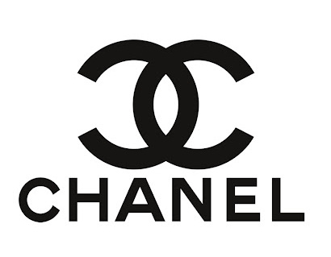

There is a general perception that “logo design” and “branding” are the same thing. Sometimes these two terms are even used as synonyms. However, although they are closely related and must work together in a cohesive way, they are very different processes.

#### **Table Of Contents**

* **The concepts of logo and brand explained**
* **What’s the difference between logo design and branding?**
* **Why is the logo so important for branding purposes?**
* **Conclusion**

## **The concepts of logo and brand explained**

Logo design is the process of designing a logo. And branding the process to build a brand. Therefore, to better understand the difference between logo design and branding, it is important to first define the concepts of a logo and a brand:

### **Logo definition**

A logo is an easily recognizable graphic symbol that identifies a company, a commercial product, or any public or private entity. It is one of the ways to distinguish a brand in a competitive world, full of graphic elements that try to attract our attention every day. A logo is generally a combination of typographies, graphics/symbols, and colors. It is a graphic element that is part of the visual identity of a brand.

#### **For example the CHANEL logo**

_CHANEL’s logo is one of the most famous logos amongst luxury brands. It is composed of two opposite-facing and interlocking C’s and the word CHANEL written in all caps. Sometimes the brand uses the two C’s separately (on some product packaging for example) or just the “CHANEL” part (on the website for example). As such, there is a multipurpose use of the logo across different channels._

### **Brand definition**

A brand is the idea or image people have in mind when thinking about specific products, services, and activities of a company, both in a practical and emotional way. This combination of physical and emotional cues is triggered when exposed to all the touchpoints between a person and a specific brand. These can be the brand name, logo, products, visual identity, staff, or advertising – amongst others.

#### **For example the CHANEL brand**

_*After seeing the logo, and if you are a bit familiar with the brand, some images and emotions might come to your mind, and it might look something like the photo collage above. Some people might feel a sense of luxury and elegance, recall the founder of the brand as a fashion icon, think of the products (make-up, clothes, accessories), French haute couture, the high prices, or the in-store experience. The experience and perception will be different for each one of us. However, as a result of CHANEL’s branding strategy, the overall impression of the brand should be quite similar to the general population.*_ 

### **What’s the difference between logo design and branding?**

**Logo** design is the process of designing a logo.

**Branding** is the process of building a brand. To be more specific, it is a strategy designed by companies to help people to quickly identify their products and organization, and give them a reason to choose their products over the competition. A branding strategy clarifies what a particular brand is and is not.

Branding can be done through the use of different tools. Some of the elements that are used in a branding strategy are:

* **Brand definition:** purpose, values, promise
* **Brand identity:** name, tone of voice, visual identity design (which includes the logo design)
* **Advertising and communications:** TV, radio, magazines, outdoor ads, website, mobile apps…
* **Sponsoring and partnerships**
* **Product and packaging design**
* **In-store experience**
* **Workspace experience and management style**
* **Customer service**
* **Pricing strategy**

As we can see, logo design is one of the tools used to design the visual identity of a brand.

## **Why is the logo so important for branding purposes?**

Although a logo is only one of the elements of branding, it will most likely appear on the majority of touchpoints with customers and other stakeholders, such as the website, brochures, stationery, product, packaging, ads, uniforms, stores, and so on.

A logo can therefore be considered as one of the main graphic elements that allow people to quickly identify an organization, its products, and services. And quite often, it will be the first thing people will use to identify you.

Here is why a well-designed logo is so important for branding purposes:

1. **A well-designed logo allows people to quickly identify and recall your brand**

	A logo is one of the main points of identification for your clients and other stakeholders. It will help then to detect your brand in a few seconds, across different channels and touchpoints.

2. **It creates consistency over different communication channels**

	In today’s world, businesses and organizations exist on various platforms, including websites, blogs, social media, events, leaflets, brochures, business cards, etc. Having a multipurpose logo will allow you to appropriately represent your brand in a consistent way across all different communication channels.

3. **It is part of your brand identity**

	The logo of your brand or organization will be part of your (visual) brand identity. This is very important because it will be one of the main tools to graphically reflect your brand name, values, and personality to the rest of the people you communicate with.

4. **It fosters a professional image and raises expectations**

	People expect a brand to have a professional look, starting with its logo. A good logo design made by an expert designer will make your brand stand out, but also look more reliable and trustworthy. Also, hiring a logo designer will increase your chances to have a logo that is unique, innovative, and reflecting your brand’s identity.

5. **It will distinguish your brand from the competition**

	Brands can play with logo design to differentiate themselves from the competition. The use of different colors, shapes, styles, and typographies for the logo design are a great way to show what your brand is and is not, as compared to the competitors. A relevant logo design will also help people recall the brand within the industry.

6. **It can facilitate an emotional connection with your stakeholders and boost brand loyalty**

	People should instantly connect with your brand when they see your logo. A good logo design will help enhance people’s memory of your organization and how it makes them feel. If the feeling is positive, whether the person is a potential client, employee or provider, the logo will contribute to his/her emotional connection with the brand, amongst the other elements of your branding strategy. This is something we’ve seen back in 2010 when the clothing brand Gap decided to change its logo and many consumers were so disappointed with the new logo design that the company chose to return to the original one.

## **Conclusion**

To conclude, a logo by itself is a graphic element that represents the brand, while a brand is a combination of all tangible and intangible aspects that represent the organization. Without the brand, the logo wouldn’t have a real meaning, it would be simply a graphical element.

When combined, a well-designed logo and an effective branding strategy help organizations reach their audiences in an effective way, but also create a resilient, industry-leading brand. If you are an entrepreneur and looking into building a new brand, don’t underestimate the importance of a well-designed logo, aligned to your overall branding strategy. It will be a rewarding investment for your brand and organization in the long term.